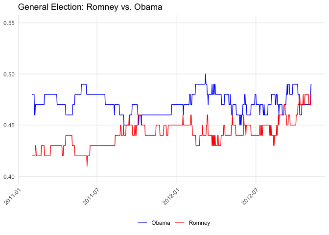

<!-- README.md is generated from README.Rmd. Please edit that file -->

# realclearpolitics

<!-- badges: start -->

<!-- badges: end -->

The goal of realclearpolitics is to make it easy to download poll data
and moving averages from realclearpolitics.com

## Installation

You can install the development version with

``` r
devtools::install_github("alexpavlakis/realclearpolitics")
```

## Example

If we want to scrape the RCP table of national polls from the 2012
presidential election, we can enter the RCP URL of interest as the `url`
arguement of `get_rcp_polls`.

``` r
library(realclearpolitics)

# Scrape the table of polls
url <- "https://www.realclearpolitics.com/epolls/2012/president/us/general_election_romney_vs_obama-1171.html"
polls <- get_rcp_polls(url = url)
head(polls)
#> # A tibble: 6 x 7
#>   Poll                     Date    Sample MoE   `Obama (D)` `Romney (R)` Spread 
#>   <chr>                    <chr>   <chr>  <chr>       <dbl>        <dbl> <chr>  
#> 1 "Final Results"          --      --     --           51.1         47.2 Obama …
#> 2 "RCP Average"            10/31 … --     --           48.8         48.1 Obama …
#> 3 "Politico/GWU/Battlegro… 11/4 -… 1000 … 3.1          47           47   Tie    
#> 4 "Rasmussen\r\n         … 11/3 -… 1500 … 3.0          48           49   Romney…
#> 5 "IBD/TIPPIBD/TIPP"       11/3 -… 712 LV 3.7          50           49   Obama …
#> 6 "CNN/Opinion\r\n       … 11/2 -… 693 LV 3.5          49           49   Tie

# "Tidy" it up
tidied_polls <- tidy(polls)
head(tidied_polls)
#> # A tibble: 6 x 7
#>   pollster             poll_start poll_end sample_size sample_type answer    pct
#>   <chr>                <chr>      <chr>          <dbl> <chr>       <chr>   <dbl>
#> 1 Politico/GWU/Battle… 11/4       11/5            1000 LV          Obama …  0.47
#> 2 Rasmussen Reports    11/3       11/5            1500 LV          Obama …  0.48
#> 3 IBD/TIPP             11/3       11/5             712 LV          Obama …  0.5 
#> 4 CNN/Opinion Research 11/2       11/4             693 LV          Obama …  0.49
#> 5 Gallup               11/1       11/4            2700 LV          Obama …  0.49
#> 6 ABC News/Wash Post   11/1       11/4            2345 LV          Obama …  0.5
```

If we want the RCP moving average, we can identify a race by its “id”,
which can be be found in the URL (e.g., the id for 2012 Obama-Romeny
national polls is 1171), and use that the scrape the raw data behind
RCP’s charts.

``` r
ma <- get_rcp_ma(id = 1171)

head(ma)
#> # A tibble: 6 x 4
#>   question                           date       answer   pct
#>   <chr>                              <date>     <chr>  <dbl>
#> 1 General Election: Romney vs. Obama 2012-11-06 Obama   0.49
#> 2 General Election: Romney vs. Obama 2012-11-06 Romney  0.48
#> 3 General Election: Romney vs. Obama 2012-11-05 Obama   0.49
#> 4 General Election: Romney vs. Obama 2012-11-05 Romney  0.48
#> 5 General Election: Romney vs. Obama 2012-11-04 Obama   0.48
#> 6 General Election: Romney vs. Obama 2012-11-04 Romney  0.47

plot(ma) +
  ggplot2::ylim(0.4, 0.55) +
  ggplot2::scale_color_manual(values = c('blue', 'red'))
```


